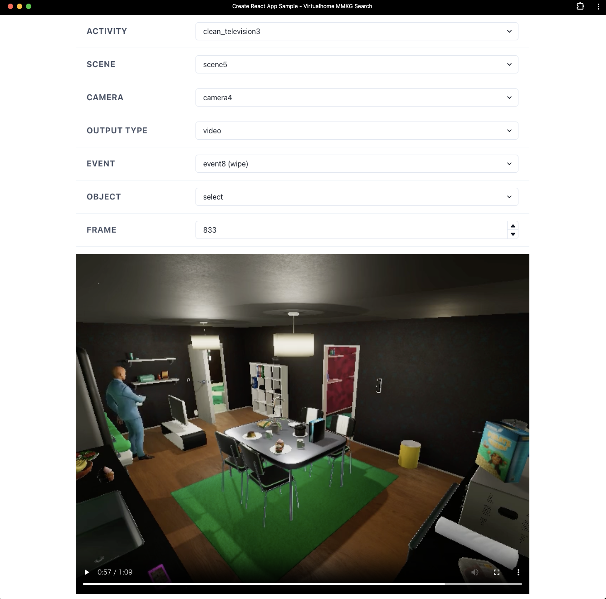
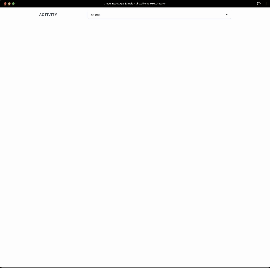

# VHAKG tools

## How to use

### GUI

- Run `mkdir RDF` only for the first time
- Place RDF Data on RDF/ only for the first time
- Run `chmod +x entrypoint.sh` only for the first time
- Run `docker compose up --build -d`
    - **If you use anything besides Apple Silicon, change the [GraphDB image](https://github.com/aistairc/vhakg-tools/blob/9ff62e2607846627abd75cfd53376d2b12b8bd23/compose.yaml#L21C5-L21C41) from `ontotext/graphdb:10.4.4-arm64` to `ontotext/graphdb:10.4.4`**
- Wait for data to be loaded until the Docker GraphDB container displays the log `[main] INFO com.ontotext.graphdb.importrdf.Preload - Finished`.
- Open http://localhost:5050

### CLI

- Perform the same steps as in GUI
- Run `cd cli`
- Run `pip install -r requirements.txt` only for the first time
- Run `python mmkg-search.py -h` if you want to know command arguments
- Run `python mmkg-search.py args`

## How to develop

### GUI

  

- Run `mkdir RDF` only for the first time
- Place RDF Data on RDF/ only for the first time
- Run `chmod +x entrypoint.sh` only for the first time
- Run `COMPOSE_FILE=compose.yaml:development.yaml docker compose up`
- Wait for data to be loaded until the Docker GraphDB container displays the log `[main] INFO com.ontotext.graphdb.importrdf.Preload - Finished`.
- Open http://localhost:5051

#### Lint

- Run `docker compose exec app-dev sh -c "cd /app && yarn lint"`

#### Format

- Run `docker compose exec app-dev sh -c "cd /app && yarn format"`

### CLI

#### Environment

- Run `pyenv install  miniforge3-4.14.0-2`
- Run `pyenv virtualenv miniforge3-4.14.0-2 vhakg-tools`

## Experiments

An experimental example of dataset creation and LVLM evaluation using VHAKG  

### Dataset creation
- Run `pip install notebook`
- Run `jupyter notebook`
- Open&amp;Run `create_benchmark_dataset.ipynb`

### Evaluation
#### GPT-4V
- Run `pip install openai`
- Run `jupyter notebook`
- Open&amp;Run `evaluate_lvlm.ipynb` with your OpenAI API key

#### LLaVa
- Our set up
    - NVIDIA A100 (1 core)
    - Python 3.10
    - cuda 12.1

- Install [LLaVa (llava-v1.5-7b)](https://github.com/haotian-liu/LLaVA/tree/main)
- Run `python evaluate_llava.py`