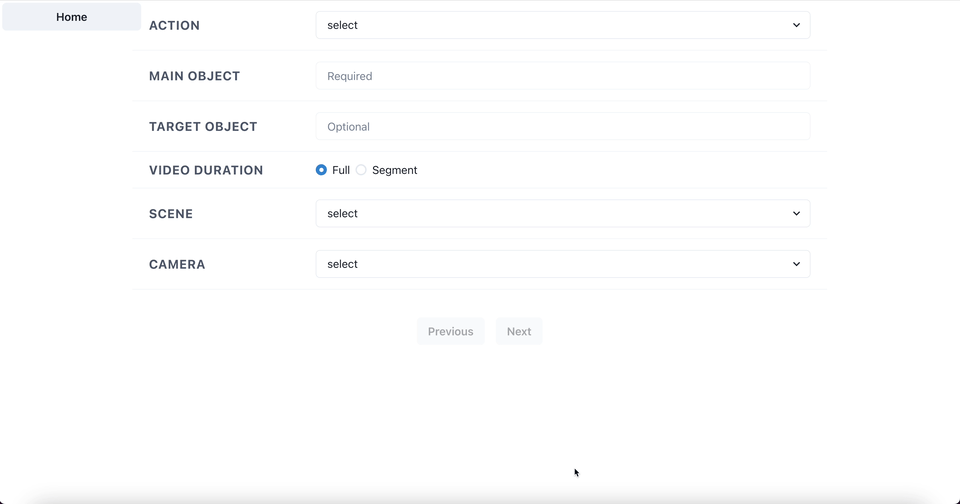

<p align="center">


</p>

# VHAKG tools

This repository provides a set of tools for searching and extracting videos from [VHAKG](https://github.com/aistairc/vhakg), a multi-modal knowledge graph (MMKG) of multi-view videos of daily activities.

## Contents

- [How to use](#how-to-use)
  - [Prerequisites](#prerequisites)
  - [GUI](#gui)
  - [CLI](#cli)
  - [SPARQL](#sparql)
- [How to develop](#how-to-develop)
- [Experiments](#experiments)

## How to use

### Prerequisites

- Local machine (RAM: 32GB, HDD: free space 150GB)
  - If there is not enough free memory, loading will be skipped; increase Docker's memory allocation. We have allocated 16 GB of memory to Docker and confirmed that it works. It may work with a little less.
- Install [Docker](https://docs.docker.com/engine/install/)
- Download [VHAKG](https://github.com/aistairc/vhakg)  
  [](https://doi.org/10.5281/zenodo.11438499)

### GUI

- Run `mkdir RDF`.
- Place VHAKG's `.ttl` files on `RDF/` only for the first time
  - **Important:** Please do not place any files other than `.ttl` under the `RDF/`. Please delete `.DS_Store` if it exists.
- Run `chmod +x entrypoint.sh` only for the first time
- Run `docker compose up --build -d`
  - **Important:** If you are not using Apple Silicon, you must change the [GraphDB image in compose.yaml](https://github.com/aistairc/vhakg-tools/blob/9ff62e2607846627abd75cfd53376d2b12b8bd23/compose.yaml#L21C5-L21C41) from `ontotext/graphdb:10.4.4-arm64` to `ontotext/graphdb:10.4.4`
- Wait for data to be loaded until the Docker GraphDB container displays the log `[main] INFO com.ontotext.graphdb.importrdf.Preload - Finished`.
- Open http://localhost:5050
  - Please wait a moment when you open first time, as the back-end system needs to load the activity data.
- Select the search tool you would like to use

> [!NOTE]
> You can switch between two types of search tools by clicking the button at the top left of each page.

<p align="center">
  
</p>

#### Demonstration

- Searching by activities
  - http://localhost:5050

<p align="center">
  
</p>

- Searching by actions
  - http://localhost:5050/action-object-search

<p align="center">
  
</p>

### CLI

- Perform the same steps as in GUI
- Run `cd cli`
- Run `pip install -r requirements.txt` only for the first time
- Select the tool you would like to use:
  - Search by activities
    - Run `python mmkg-search.py -h` if you want to know command arguments
    - Run `python mmkg-search.py args`
  - Search by actions
    - Run `python action-object-search.py -h` if you want to know command arguments
    - Run `python action-object-search.py args`

#### Example

Extract the video segment of the "grab" part from the camera4’s video of "clean_kitchentable1" in scene1.

```shell
python mmkg-search.py clean_kitchentable1 scene1 camera4 . -a grab
```

Extract videos which contain an event "put" and its main object is "bread" and its target object is "fryingpan".

```shell
python action-object-search.py put bread -t fryingpan -f .
```

### SPARQL

- Users familiar with SPARQL can use the GraphDB SPARQL endpoint at [localhost:7200/sparql](http://localhost:7200/sparql).

## How to develop

### GUI

- Run `mkdir RDF` only for the first time
- Place RDF Data on RDF/ only for the first time
- Run `chmod +x entrypoint.sh` only for the first time
- Run `COMPOSE_FILE=compose.yaml:development.yaml docker compose up`
- Wait for data to be loaded until the Docker GraphDB container displays the log `[main] INFO com.ontotext.graphdb.importrdf.Preload - Finished`.
- Open http://localhost:3000

#### Lint

- Run `docker compose exec app-dev sh -c "cd /app && yarn lint"`

#### Format

- Run `docker compose exec app-dev sh -c "cd /app && yarn format"`

### CLI

#### Environment

- Run `pyenv install  miniforge3-4.14.0-2`
- Run `pyenv virtualenv miniforge3-4.14.0-2 vhakg-tools`

## Experiments

An experimental example of dataset creation and LVLM evaluation using VHAKG

### Dataset creation

- Run `pip install notebook`
- Run `jupyter notebook`
- Open&amp;Run [create_benchmark_dataset.ipynb](./experiments/create_benchmark_dataset.ipynb)

### Evaluation

#### GPT-4o and GPT-4V

- Run `pip install openai`
- Run `jupyter notebook`
- Open&amp;Run [evaluate_lvlm.ipynb](./experiments/evaluate_lvlm.ipynb) with your OpenAI API key
